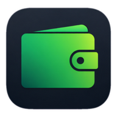

# nTransactions — All-in-One Personal Finance Tracker & Smart Money Manager

<p align="center">
  
</p>

<p align="center">
  <strong>The Ultimate Privacy-First, Offline-Capable, Ad-Free Personal Finance, Multi-Wallet & Expense Tracker with AI Assistance and MCP Integration.</strong>
</p>

<p align="center">
  <a href="https://github.com/nasimulrizvi/nTransactions/stargazers"></a>
  <a href="https://github.com/nasimulrizvi/nTransactions/network/members"></a>
  <a href="https://github.com/nasimulrizvi/nTransactions/issues"></a>
  <a href="./LICENSE"></a>
  <a href="https://nodejs.org/"></a>
  <a href="https://web.dev/progressive-web-apps/"></a>
  
  
</p>

---

## 📌 Overview

**nTransactions** is a production-grade, privacy-first **Personal Finance Management (PFM)** progressive web application engineered to give individuals, freelancers, families, and small business owners full sovereignty over their financial lives.

Unlike commercial money management applications that harvest user data, lock essential features behind recurring subscriptions, or clutter screens with predatory financial ads, **nTransactions is 100% ad-free, offline-first, blazing fast, and platform independent**. It seamlessly combines traditional double-entry money tracking, multi-wallet balance management, loan amortization, and monthly budget limits with cutting-edge **Gemini AI voice processing, automated banking SMS parsing, intelligent email statements via SMTP, and Model Context Protocol (MCP) connectivity**.

> **Designed & Built with passion by [Md. Nasimul Islam Rizvi](https://github.com/nasimulrizvi).**

---

## 🚀 Key Highlights & Architectural Advantages

- 🛡️ **Zero Tracking, 100% Data Privacy:** Your financial records belong strictly to you. Works with encrypted local browser storage and optional private Firebase cloud sync.
- ⚡ **Zero-Bloat Performance:** Built using highly optimized vanilla JavaScript, lightweight CSS, and native web APIs. Page loads in under 1 second without massive frontend bundle sizes.
- 📶 **True Offline-First Architecture:** Full Service Worker caching (`sw.js`). You can add expenses, check balances, and review budgets in airplane mode or with zero internet connection.
- 🤖 **Next-Gen AI & MCP Ready:** Voice-to-transaction parser, interactive AI Financial Assistant, and seamless MCP integration allowing AI agents (such as Claude Desktop or Gemini) to securely query your financial records.

---

## 📑 Table of Contents

- [Features & Comprehensive Usage Guide](#-features--comprehensive-usage-guide)
  - [1. Track Income and Expenses](#1-track-income-and-expenses)
  - [2. Manage Multiple Wallets](#2-manage-multiple-wallets)
  - [3. Track Loans and Deposits](#3-track-loans-and-deposits)
  - [4. Set Budgets](#4-set-budgets)
  - [5. Follow Savings Goals](#5-follow-savings-goals)
  - [6. Sync Data Across Devices](#6-sync-data-across-devices)
  - [7. Use Offline When Needed](#7-use-offline-when-needed)
  - [8. Get Reminders and Updates](#8-get-reminders-and-updates)
  - [9. Pro Analytics](#9-pro-analytics)
  - [10. Platform Independent](#10-platform-independent)
  - [11. 100% Ad-Free Experience](#11-100-ad-free-experience)
  - [12. Voice Transaction Features](#12-voice-transaction-features)
  - [13. Review Records Easily](#13-review-records-easily)
  - [14. SMS Transaction Parser](#14-sms-transaction-parser)
  - [15. Export to Excel & Spreadsheets](#15-export-to-excel--spreadsheets)
  - [16. Auto SMS Detection](#16-auto-sms-detection)
  - [17. AI Finance Assistant](#17-ai-finance-assistant)
  - [18. Model Context Protocol (MCP) Support](#18-model-context-protocol-mcp-support)
- [Keyboard Shortcuts](#-keyboard-shortcuts)
- [Tech Stack](#-tech-stack)
- [Quick Start & Installation](#-quick-start--installation)
- [Environment Configuration](#-environment-configuration)
- [Security & Privacy](#-security--privacy)
- [License & Attribution](#-license--attribution)
- [Author & Contact](#-author--contact)

---

## 🌟 Features & Comprehensive Usage Guide

### 1. Track Income and Expenses
Log financial activity with zero friction. Every transaction supports hierarchical categorization, subcategories, custom timestamps, associated payment wallets, and memo notes.
- **How to Use:**
  1. Click the floating **`+`** button or press shortcut key `+` / `N` on desktop.
  2. Select **Expense** or **Income**.
  3. Enter the amount, pick the category (e.g., Food & Groceries, Housing, Salary, Freelance, Health), and choose the corresponding wallet.
  4. Select the exact date and time using the custom DateTime picker.
  5. Hit **Save Transaction**. The wallet balance updates instantly in real time.

### 2. Manage Multiple Wallets
Organize your money across liquid cash, bank accounts (e.g., City Bank, DBBL, Chase), mobile financial services (e.g., bKash, Nagad, Rocket, PayPal), and credit cards.
- **How to Use:**
  1. Navigate to the **Wallets** tab (`Alt + 2`).
  2. Click **Add Wallet**, input a title, choose an icon/color, and enter the initial balance.
  3. Perform inter-wallet transfers (e.g., Bank to bKash or ATM Cash Withdrawal) with automatic double-entry debit/credit reconciliation.
  4. Click any wallet card to inspect its isolated chronological ledger.

### 3. Track Loans and Deposits
Complete debt, credit, and peer-to-peer lending ledger. Track money you borrowed from someone or money you lent to others, with due dates, interest, and partial repayment history.
- **How to Use:**
  1. Go to **Loans & Debts** (`Alt + 4`).
  2. Choose **Lent (Money you gave)** or **Borrowed (Money you took)**.
  3. Enter the counterparty person's name, principal amount, due date, and note.
  4. Log partial repayments at any time. The system calculates the remaining balance and highlights overdue or upcoming maturities.

### 4. Set Budgets
Prevent overspending with custom monthly expenditure limits across categories.
- **How to Use:**
  1. Open the **Budgets** section.
  2. Set spending ceilings for individual categories (e.g., Groceries: $300/mo, Dining: $100/mo) or a master monthly allowance.
  3. Monitor dynamic visual progress bars that turn from emerald green to amber warning and crimson danger when approaching thresholds.

### 5. Follow Savings Goals
Visualize your financial dreams and build emergency funds with automated milestone tracking.
- **How to Use:**
  1. Head to **Savings Goals**.
  2. Create a goal (e.g., "Emergency Fund", "New Laptop", "Hajj Fund", "Vacation").
  3. Allocate funds toward your goal from your existing wallets.
  4. Watch real-time completion percentages and projected target dates.

### 6. Sync Data Across Devices
Enjoy real-time, multi-device synchronization without handing your credentials over to untrusted servers.
- **How to Use:**
  1. Open **Settings > Cloud Sync**.
  2. Connect using your private Firebase Realtime Database configuration.
  3. Changes made on your mobile phone synchronize instantaneously to your desktop laptop or tablet via WebSocket diff listeners.

### 7. Use Offline When Needed
nTransactions is an **Offline-First Progressive Web App (PWA)**.
- **How to Use:**
  1. Open nTransactions in Chrome, Safari, Edge, or Firefox.
  2. Click the browser's **Install App** button to pin it to your desktop or mobile home screen.
  3. Launch and operate the app in offline mode without internet. All inputs are safely stored in browser `localStorage` and IndexedDB, then auto-synced once your connection restores.

### 8. Get Reminders and Updates
Automated email digests and alert notifications powered by SMTP.
- **How to Use:**
  1. Configure SMTP credentials (`SMTP_HOST`, `SMTP_USER`, `SMTP_PASS`) in the environment settings.
  2. Enable **Monthly Financial Statement** to receive a rich HTML summary statement on the 1st day of every month.
  3. Enable **Loan Due Reminders** to receive automated notification alerts 2 days before and on the exact due date of upcoming loan maturities.

### 9. Pro Analytics
Gain comprehensive financial intelligence with interactive cash flow visualizers, category breakdowns, and historical trends.
- **How to Use:**
  1. Click **Analytics** (`Alt + 3`).
  2. Filter by **Lifetime**, **Yearly**, or **Monthly** viewports.
  3. Review category spend distributions, income-to-expense ratios, average daily burn rates, and projected end-of-month runway.

### 10. Platform Independent
Built on modern W3C open web standards, nTransactions runs smoothly across all operating systems without platform lock-in.
- **Supported Platforms:** Windows, macOS, Linux, ChromeOS, Android, and iOS. Works uniformly as an installed native-like desktop/mobile app or inside any standard web browser.

### 11. 100% Ad-Free Experience
- **Zero Ads, Zero Sponsors, Zero Popups:** nTransactions is entirely free of banner advertisements, video popups, tracking pixels, or affiliate upsells. The interface remains clean, focused, and distraction-free.

### 12. Voice Transaction Features
Hands-free expense recording powered by Google Gemini AI.
- **How to Use:**
  1. Tap the **Microphone** icon in the quick action bar.
  2. Speak naturally in English or Bengali (e.g., *"Spent 350 taka on groceries from bKash"* or *"Received 50000 salary in City Bank"*).
  3. Gemini AI automatically extracts the amount, transaction type, category, and wallet, filling out the transaction form with sub-second latency.

### 13. Review Records Easily
Filter, search, and navigate through thousands of transactions with high-speed indexing.
- **How to Use:**
  1. Navigate to **Transactions** (`Alt + 1`).
  2. Use the live search bar (`Ctrl + F`) with **35ms debouncing** to filter records instantly by category, wallet, notes, or subcategories.
  3. Filter by transaction type (All, Expense, Income, Transfer, Loans) or time windows (Monthly, Yearly, Lifetime).
  4. Quick edit, duplicate, or delete any record with dedicated row actions.

### 14. SMS Transaction Parser
Turn cryptic bank SMS notifications into organized records with a single click.
- **How to Use:**
  1. Open the **SMS Parser** modal.
  2. Paste any SMS received from your bank or mobile financial service (e.g., bKash, Nagad, City Bank, Brac Bank, Islami Bank).
  3. The regex & AI parser automatically detects the debit/credit nature, amount, merchant name, and date, preparing a one-click entry.

### 15. Export to Excel & Spreadsheets
Own your data with universal file export options.
- **How to Use:**
  1. Press `Ctrl + E` or open **Settings > Export Data**.
  2. Choose **Export to Excel / CSV** or **Full JSON Backup**.
  3. Download clean, formatted spreadsheets compatible with Microsoft Excel, Google Sheets, LibreOffice, or professional accounting software.

### 16. Auto SMS Detection
Automated background parsing for mobile users.
- **How to Use:**
  1. Compatible with Web SMS Receiver APIs and clipboard watchers.
  2. When an OTP/Transaction notification is copied or shared with the app, nTransactions automatically proposes a pre-filled transaction form, eliminating manual typing.

### 17. AI Finance Assistant
Interactive financial copilot directly inside your app.
- **How to Use:**
  1. Click the **Finance Assistant** bubble icon.
  2. Ask questions such as *"Where did I spend the most money this month?"*, *"How can I reduce my grocery expenses?"*, or *"Can I afford a $400 purchase this week?"*.
  3. The assistant reviews your anonymized budget figures and provides personalized financial tips and savings strategies.

### 18. Model Context Protocol (MCP) Support
Connect nTransactions directly to external AI workflows (Claude Desktop, Cursor, or Gemini Agent CLI) via standardized Model Context Protocol tools.
- **How to Use:**
  1. Point your MCP client to the nTransactions server endpoint.
  2. Allow the AI agent to execute read-only or authorized write commands:
     - `get_wallets_summary`: Returns current account balances.
     - `query_transactions`: Filters expenses by date, wallet, or category.
     - `add_transaction`: Logs new income/expense through conversational AI prompts.

---

## ⌨️ Keyboard Shortcuts

Power users can navigate nTransactions entirely from the keyboard:

| Shortcut | Action |
| :--- | :--- |
| `Ctrl` / `Cmd` + `F` | Focus instant search bar |
| `Ctrl` / `Cmd` + `E` | Open Data Export dialog |
| `Ctrl` / `Cmd` + `I` | Open Data Import dialog |
| `Ctrl` / `Cmd` + `,` | Open Sync & Settings |
| `Ctrl` / `Cmd` + `Z` | Undo last transaction add/edit/delete |
| `Ctrl` / `Cmd` + `Enter` | Submit / Save active modal form |
| `Alt` + `1` | Switch to **Transactions** view |
| `Alt` + `2` | Switch to **Wallets** view |
| `Alt` + `3` | Switch to **Analytics** view |
| `Alt` + `4` | Switch to **Loans & Debts** view |
| `Alt` + `1-9` *(in modal)* | Jump to the *N*-th input field |
| `Esc` | Close any open modal or dropdown |
| `Arrow Down` / `Arrow Up` | Navigate transaction list rows |

---

## 🛠️ Tech Stack

- **Frontend:** Vanilla TypeScript / Modern ECMAScript 2024, HTML5, CSS3 with Tailwind CSS utility architecture.
- **Service Worker & PWA:** Custom `sw.js` with offline caching and background synchronization.
- **Backend Server:** Node.js, Express.js with gzip/brotli compression (`compression`).
- **AI Engine:** Google Gemini API (`@google/genai`) for conversational intelligence and voice transcription.
- **Mail Engine:** Nodemailer with verified TLS/STARTTLS SMTP delivery.
- **Database & Storage:** LocalStorage, IndexedDB + Firebase Realtime Database.
- **Reporting Engine:** Native CSV/XLSX generator, dynamic SVG & Canvas charting engines.

---

## 💻 Quick Start & Installation

### Prerequisites
- [Node.js](https://nodejs.org/) (version 18.x or higher recommended)
- [npm](https://www.npmjs.com/) or [bun](https://bun.sh/)

### 1. Clone the Repository
```bash
git clone https://github.com/nasimulrizvi/nTransactions.git
cd nTransactions
```

### 2. Install Dependencies
```bash
npm install
```

### 3. Setup Environment Variables
Copy the example environment configuration:
```bash
cp .env.example .env
```
*(Fill in your custom SMTP, Gemini API, or Firebase credentials if cloud sync and email notifications are required.)*

### 4. Start the Application
```bash
npm run dev
# Or for production:
npm start
```
Open your browser and navigate to: **`http://localhost:3000`**

---

## ⚙️ Environment Configuration

| Variable | Description | Default |
| :--- | :--- | :--- |
| `PORT` | Local web server listening port | `3000` |
| `GEMINI_API_KEY` | Google Gemini API key for Voice & AI Assistant | Optional |
| `SMTP_HOST` | Outgoing SMTP email host (e.g. `smtp.resend.com`, `smtp.zoho.com`) | `smtp.resend.com` |
| `SMTP_PORT` | SMTP port (`587` for TLS / `465` for SSL) | `587` |
| `SMTP_USER` | SMTP username | `resend` |
| `SMTP_PASS` | SMTP password / API token | Optional |
| `SMTP_FROM` | Outgoing sender address | `support@app.nasimulrizvi.com` |
| `SMTP_REPLY_TO` | Reply-to recipient address | `hello@nasimulrizvi.com` |

---

## 🔒 Security & Privacy

1. **Zero Data Monetization:** We never sell, track, or share your financial data with marketing brokers or advertisers.
2. **Local Storage First:** All wallets, transactions, loans, and categories reside directly on your local device.
3. **Bring Your Own Cloud:** If you choose to sync across devices, data is synced directly between your devices and your private Firebase instance.

---

## 📄 License & Attribution

This project is licensed under a customized **Creative Commons Attribution-NonCommercial 4.0 International (CC BY-NC 4.0)** license.

### Permissions
- ✔️ Free personal and non-commercial usage.
- ✔️ Freedom to share, distribute, and study the source code.
- ✔️ Modification for personal workflow needs.

### Restrictions
- ❌ **Commercial use is strictly prohibited.**
- ❌ **You may NOT re-publish, sell, monetize, or bundle this application with advertisements.**
- ❌ **Mandatory Attribution:** Any derivative works or distributions **MUST** prominently display:
  > **"Designed & Built by Md. Nasimul Islam Rizvi"**

For full legal terms, consult the [`LICENSE`](./LICENSE) file.

---

## 👨‍💻 Author & Contact

**Md. Nasimul Islam Rizvi**  
Gazipur, Dhaka, Bangladesh  

- 🌐 GitHub: [@nasimulrizvi](https://github.com/nasimulrizvi)
- 💼 Repository: [https://github.com/nasimulrizvi/nTransactions](https://github.com/nasimulrizvi/nTransactions)
- ✉️ Email: [hello@nasimulrizvi.com](mailto:hello@nasimulrizvi.com)

---

<p align="center">
  ⭐ If you find <strong>nTransactions</strong> helpful, please consider giving the repository a <strong>Star</strong> on GitHub!
</p>
